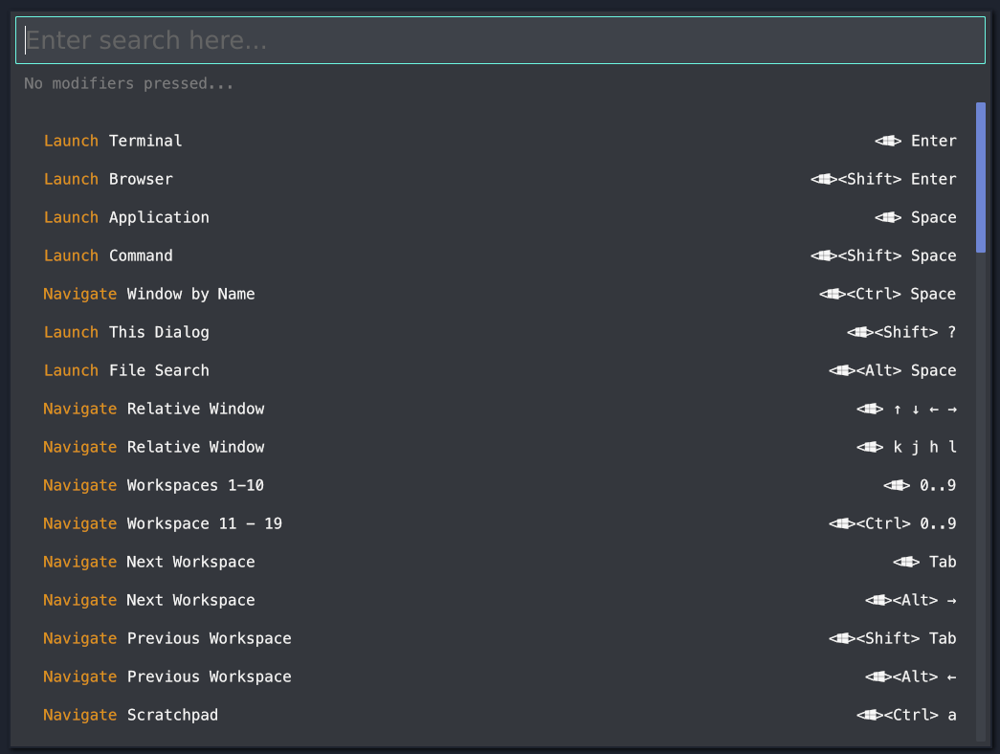

# i3 Config Searcher

[](https://github.com/dmweis/i3-conf-searcher/actions)
[](https://github.com/dmweis/i3-conf-searcher/actions)
[](https://codecov.io/gh/dmweis/i3-conf-searcher)

Heavily inspired by [Remontoire](https://github.com/regolith-linux/remontoire)  
And the amazing [Regolith Linux group](https://github.com/regolith-linux)  
Please check them out!



## Usage

You can both fuzzy search by text or by modifier keys

Be warned that modifier keys are a bit flakey on some distros!  
Meta and Alt sometimes have issues registering, you may need to tap Ctrl to cause the display to refresh.

## Installation

To install from source you can use cargo

```shell
cargo install --git https://github.com/dmweis/i3-conf-searcher
```

if you a using X11 and you are building from source you may need the `librust-x11-dev` package available in repository for Ubuntu 20.4

## i3 Config

You can add the following entry to your i3 config to make it easier to use

```bash
## Launch // Config searcher // <> m ##
bindsym $mod+m exec i3-conf-searcher
for_window [class="i3-conf-searcher"] floating enabled
for_window [class="i3-conf-searcher"] move position center

```
